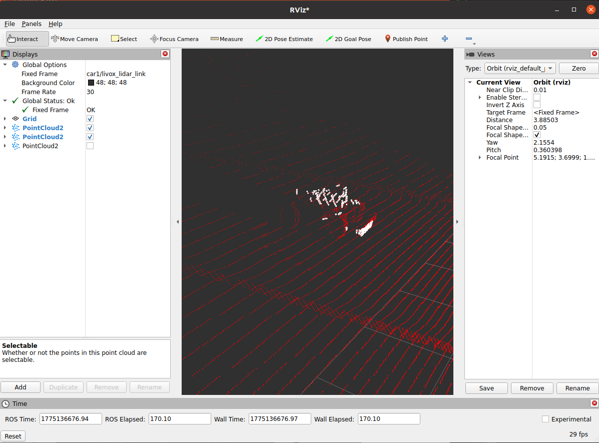
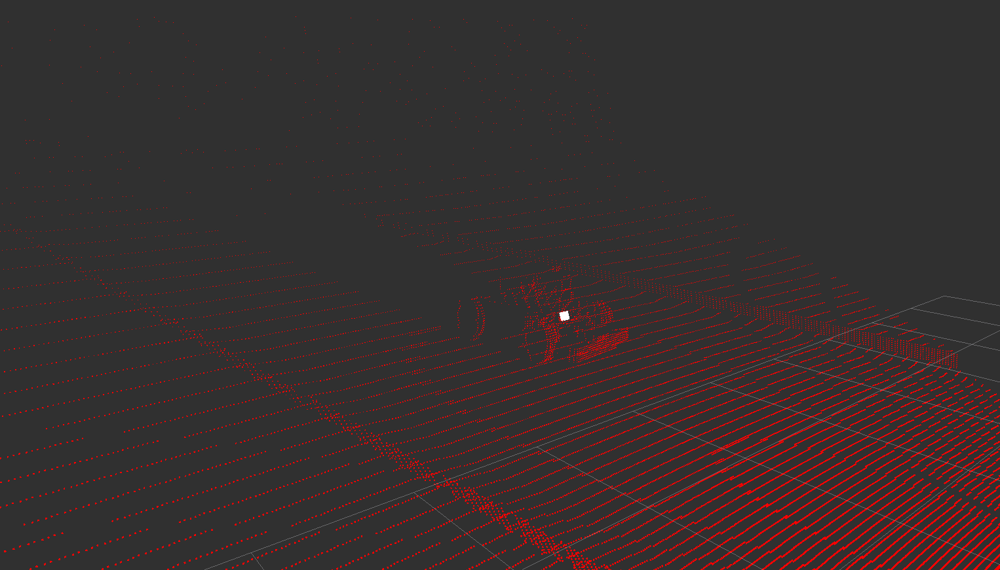

# Clothoid-R Camera Seminar

이 저장소는 크게 두 부분으로 나뉩니다.

- `train`
- `ros2-detect & calib`

---
## `train`

훈련 환경 구축은 오로지 로컬 환경에서 진행합니다.

### 환경 구축

`conda`가 설치되어 있지 않다면 먼저 아래 자료를 참고해서 설치합니다.

- Ubuntu 22.04: <https://gosury32.tistory.com/14>
- Ubuntu 24.04: <https://osg.kr/archives/3899>

conda 다운 확인 명령어 입니다.

```bash
conda -V
```

```bash
#안뜰경우
/home/user/miniconda3/bin/conda init
```

이후 아래 순서대로 환경을 구성합니다.

```bash
conda create -n yolo python=3.10.9
conda activate yolo
cd ~
git clone https://github.com/Minjea31/Clothoid-R_seminar.git
cd Clothoid-R_seminar/yolov12/yolov12
pip install -r requirements.txt
pip install -e .
pip install scikit-learn
cp ~/Clothoid-R_seminar/yolov12/yolov12/utils/prune.py ~/anaconda3/envs/yolo/lib/python3.10/site-packages/torch/nn/utils/prune.py
```

### baseline_model 훈련

```bash
python train_baseline_model.py
```

최종 모델은 `checkpoint` 내부의 `baseline` 계열 마지막 폴더에 있는 `weights/best.pt`입니다.

복사하여 `~/Clothoid-R_seminar/yolov12`에 위치해주고 baseline.pt로 바꿔주세요.

### Pruning 후 모델 훈련

```bash
python pruning_finetuning.py
```

최종 모델은 `checkpoint` 내부의 `pruned` 계열 마지막 폴더에 있는 `weights/best.pt`입니다.

또한 `pruned_yaml` 폴더 안에는 pruning 모델에 대응하는 `best.yaml` 파일이 있습니다.

Pruning 모델은 `.pt` 파일과 `.yaml` 파일이 둘 다 있어야 정상적으로 사용할 수 있습니다.

### 주의할 점

훈련 중 `dataset.yaml` 경로 오류가 발생하면 Home 디렉터리의 `.config/yolov12/settings.json` 파일을 열고 `"datasets_dir"` 뒤 경로를 사용하려는 `dataset.yaml` 파일이 있는 경로로 수정하면 됩니다.

---
## `ros2-detect`

YOLO detect 를 실행하려면  별도 환경 구성이 필요합니다.
Docker를 사용하는 경우에는 아래처럼 Miniconda를 설치합니다.

Docker 내부에서 다운해야합니다.

Docker container가 없을경우

```bash
docker pull rth0824/autonomous-racing-simulator:ver1.1
cd Clothoid-R_seminar
sudo chmod 777 ./run_docker
./run_docker
```

```bash
# 도커 내부로 들어온 후
wget https://repo.anaconda.com/miniconda/Miniconda3-latest-Linux-x86_64.sh
bash Miniconda3-latest-Linux-x86_64.sh
source ~/.bashrc
git clone https://github.com/ttaehyun/Autonomous-Racing-Simulator.git
```

### 실행 방법

모든 터미널에서 아래 공통 명령어를 먼저 실행합니다.

```bash
source /opt/ros/kilted/setup.bash
cd Autonomous-Racing-Simulator/simulate_ws
colcon build --symlink-install
source install/setup.bash
# colcon build가 안될경우
pip uninstall em -y
python3 -m pip install empy catkin_pkg lark
```

### 1번 터미널: Open map

맵을 실행하는 터미널입니다.

```bash
gz sim -r src/server/map/racemap.sdf
```

### 2번 터미널: ERP42 제어 차량

제어할 ERP42를 실행하는 터미널입니다.

```bash
ros2 launch server spawn_car.launch.py
```

`python3 src/server/src/key_teleop.py`는 ERP-42 control 노드입니다. 키보드로 ERP-42를 직접 조작할 때는 아래 명령어를 실행합니다.

```bash
conda deactivate
python3 src/server/src/key_teleop.py
```

### 3번 터미널: 객체 ERP42

객체 역할을 하는 ERP42를 실행하는 터미널입니다.

```bash
ros2 launch server spawn_car.launch.py car_name:=test x_pos:=5 y_pos:=0 z_pos:=0.3
```

---
### 학습용 이미지 데이터 추출

YOLO를 학습시키려면 이미지 형태의 데이터가 필요합니다.

아래는 해당 데이터를 얻는 방법입니다.

#### Bag 저장 방법

아래 명령어로 bag 파일을 저장할 수 있습니다.

```bash
ros2 bag record /clock /rosout /car1/camera/image_raw -o erp42_bag
```

#### Bag 재생 방법

bag 파일을 재생할 때는 아래 명령어를 사용합니다.

```bash
cd ~
ros2 bag play erp42_bag
```

또는 `clock` 옵션을 포함해서 아래처럼 실행할 수 있습니다.

```bash
cd ~
ros2 bag play ../erp42_bag --clock
```

#### 이미지 프레임 저장 방법

bag 재생과 함께 아래 명령어를 실행하면 이미지를 프레임 단위로 저장할 수 있습니다.

환경 구축이 필요하므로 `YOLOv12 실행 환경 구축` 부분을 먼저하고 실행시켜주세요.

```bash
cd ~/Clothoid-R_seminar
python3 utils/save_images.py
```

기본값은 아래와 같습니다.

- `topic_name`: `/car1/camera/image_raw`
- `save_dir`: `/home/user/seminar/ERP42/extracted_images`
- `save_interval`: `0.1`

원하는 값으로 직접 인자를 줄 수도 있습니다.

예를 들어 아래처럼 실행할 수 있습니다.

```bash
python3 save_images.py \
  --topic-name /car1/camera/image_raw \
  --save-dir /home/user/seminar/ERP42/extracted_images \
  --save-interval 0.5
```

하이퍼파라미터 설명은 아래와 같습니다.

- `--topic-name`: 구독할 이미지 토픽 이름
- `--save-dir`: 이미지를 저장할 폴더 경로
- `--save-interval`: 몇 초마다 이미지를 저장할지 설정하는 값

---
### YOLOv12 실행 환경 구축

```bash
conda create -n clothoid python=3.12
conda activate clothoid
source /opt/ros/kilted/setup.bash
cd ~/Clothoid-R_seminar/yolov12/yolov12
pip install huggingface_hub
pip install "setuptools<80"
pip install -e .
pip uninstall numpy -y
pip install numpy==1.26.4
cd ../../camera_ws
colcon build --symlink-install
source install/setup.bash
```

### 다음 노드를 실행시킬때 가상환경이 필요합니다.
- detect_viewer
- pruned_detect_viewer
- yolo_publisher
- fusion_node


fusion_node는 yolo_publisher에 종속되어있습니다.


### Detect 노드 실행

기본 YOLO detect 노드:

```bash
sed -i '1c #!/home/user/miniconda3/envs/clothoid/bin/python' ~/Clothoid-R_seminar/camera_ws/install/yolo_detector_viewer/lib/yolo_detector_viewer/detect_viewer
ros2 run yolo_detector_viewer detect_viewer
```

경량화된 YOLO detect 노드:

```bash
sed -i '1c #!/home/user/miniconda3/envs/clothoid/bin/python' ~/Clothoid-R_seminar/camera_ws/install/yolo_detector_viewer/lib/yolo_detector_viewer/pruned_detect_viewer
ros2 run yolo_detector_viewer pruned_detect_viewer
```

YOLO bbox publisher 노드:

```bash
sed -i '1c #!/home/user/miniconda3/envs/clothoid/bin/python' ~/Clothoid-R_seminar/camera_ws/install/yolo_detector_viewer/lib/yolo_detector_viewer/yolo_publisher
ros2 run yolo_detector_viewer yolo_publisher
```

fusion 후 object publisher 노드:

```bash
sed -i '1c #!/home/user/miniconda3/envs/clothoid/bin/python' ~/Clothoid-R_seminar/camera_ws/install/lidar_camera_fusion/lib/lidar_camera_fusion/fusion_node
ros2 run lidar_camera_fusion fusion_node
```

<p align="center">
  
  
</p>

시각화 :

```bash
rviz2
```

Topic : `/object_point` -> Fixed Frame : `car1/lidar_link`


### 주의할 점

다시 `colcon build`를 하면 `detect_viewer` 스크립트가 다시 생성되면서 shebang이 아래처럼 돌아갈 수 있습니다.

```bash
#!/usr/bin/python3
```

이 경우 같은 문제가 다시 생길 수 있으므로, 아래 명령어를 다시 실행해 줍니다.

```bash
sed -i '1c #!/home/user/miniconda3/envs/clothoid/bin/python' ~/seminar/camera_ws/install/yolo_detector_viewer/lib/yolo_detector_viewer/~~~
```
